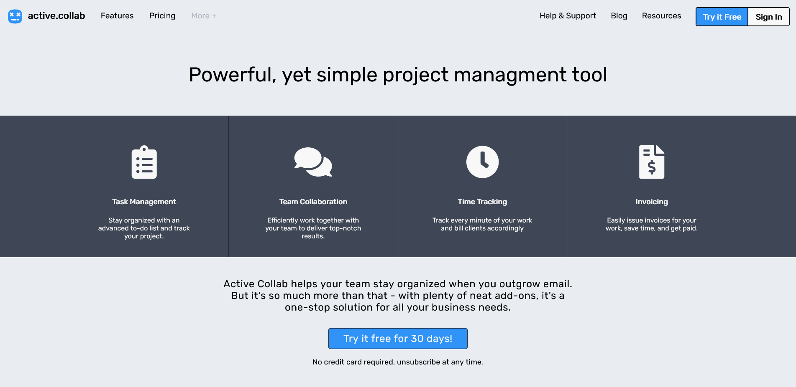

<!-- PROJECT SHIELDS -->

<!-- PROJECT LOGO -->
 

  

<h3 align="center">active.collab</h3>

  

    png layout replication
  

<!-- TABLE OF CONTENTS -->

  
Table of Contents

  <ol>
    <li>
      <a href="#about-the-project">About The Project</a>
      <ul>
        <li><a href="#built-with">Built With</a></li>
      </ul>
    </li>
    <li><a href="#roadmap">Roadmap</a></li>
    <li><a href="#contact">Contact</a></li>
  </ol>

<!-- ABOUT THE PROJECT -->
## About The Project

Exercise realized during the WebDev Junior training given by BeCode, concerning HTML and CSS.

The goal was to reproduce as faithfully as possible a predefined layout provided in png.

### Built With

* Html
* Css

<!-- ROADMAP -->
## Roadmap

- [x] HTML
- [x] CSS
- [x] Responsive
    - [ ] Hamburger Menu

<!-- CONTACT -->
## Contact

Thibaut Fourneaux - [@fourneauxthibaut](http://thibaut-fourneaux.be/) - email@email_client.com

Project Link: [https://github.com/FourneauxThibaut/active.collab](https://github.com/FourneauxThibaut/active.collab)

(<a href="#top">back to top</a>)

